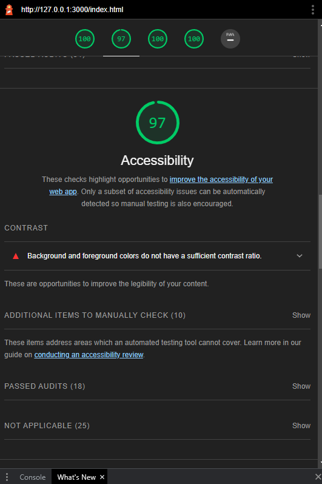
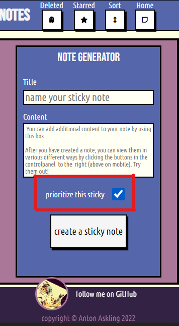

# Notes


[**Have a look on your own device**](https://4ntm4n.github.io/ms-two/index.html)

## Project outline

### **user stories:**

> Typical users are interested in getting similar functionality as they get from physical stickyNotes, but in a digital format.

- **The typical end user wants to have the ability to:**

  - create new sticky notes.
  - remove completed / irrelevant notes from the view.
  - sort notes by title name from A-Z or Z-A
  - make notes prioritized and have them showed up first in the list of notes.
  - have a view for the prioritized notes only. 
  - toggle between priority status on a note AFTER it has been created.
  - restore notes that has been removed.
  - delete notes permanently.
  - click a button that takes them to the note generator, instead of having to scroll up and down if many notes have been created.
  - view all the notes that have been removed
  

## Approach

### Design Approach

The design of the web app is dictated by the functions. I did not want to distract the user too much from the core purpose of the application: to have the ability to create and manipulate digital sticky notes. Having that said, I wanted the application to feel retro, lo-tech and incorporate a bit of humor to it. 
 
**Design features**

- Buttons have **universally understandable**  icons inside them.
- layout of buttons are **designed to be reached** by your right thumb, even on larger screens.
- **colors are contrasty** and highlights difference in different elements the user creates.
- User is **automatically taken to the relevant place on the screen** depending on what action the user takes.
- The user receives text **feedback** from within **already existing design elements** within the view when an action is taken.

**Fonts**
> **Permanent Marker** is a "scribbly font" that was chosen for the title of each note rendered in the 
> 
> view. this is to imitate the look and feel of a real sticky note. 
>
> headings have the font set to  **bebas Neue** cursive by default
> 
> Paragraphs, anchor tags, and other small text areas have the font set to **Ubuntu Condensed** with a fallback of _Sans-serif_ and to create a retro vibe while maximize readability.

**Colors**

> The choice of colors are inspired by real sticky notes, but more muted / washed out. for the overall color combination I used [this color scheme](https://www.schemecolor.com/city-by-night.php) called night city, since I felt it could add something interesting to my very basic design for this app.

**Animations**

> only notes, buttons and scroll have a slight subtle animation added to them. App is kept more simple and functions feels lighting fast by having it this way. It ties in to the overall low-tech feel of the design too while it gave me as a developer more time to focus on the functionality. 

**Layout**
> The layot of the app contains of a single page divided into 3 main sections.

1.  > **Header** <br>
    >   The header contains a form that takes the user input, called note-generator. It also contains a control-panel with the buttons that the user can interact with in order to render it's created notes in different ways.

2.  > **Notes section** <br>
    >   the notes section contains a feedback header that changes depending on how the user interacts with the page. It also contains an empty list that the user will fill with notes. these notes are displayed in a loose grid pattern using CSS's flex-box and row-wrap.

3.  > **Footer**
    >   The footer contains a link to my GitHub page and a copyright text.
        

**Framework**
> No. This project is written in vanilla JS, HTML and CSS, with a mobile first approach to responsive design.

---
<br>
<br> 

### Technical Approach

In this section we are going through the javascript functions, how they work with each other and how they respond to the users action in order to get an understanding how the application is working behind the scenes. 

<br>
<br>

#### **the handleSubmit function**
> This is the function that handles the user input data collected in the note-generator form. 
> It starts off by preventing the defult behavior of the form submit, making sure that the user stays on the same page when submit has been triggered. 
> it continues by collecting the user data, and send it to the noteMaker function where the data will be formatted into an object.
> 
>It is also this function that handles a scroll down to the added note. If the note had a prio value of true, it will scroll down to the top of the note section where the prio note will land. otherwise it should find the id of the note created, and scroll down to where that note is displayed. 

``` javaScript
const handleSubmit = (event) => {
  event.preventDefault();

  // store form input fields in variables.  
  const formTitle = document.getElementById("title-input");
  const formContent = document.getElementById("content-input");
  const formCheckbox = document.getElementById("input-checkbox");

  //control if checkbox is checked  and store it in isPrio variable.
  let isPrio = false;
  if (formCheckbox.checked) {
    isPrio = true;
  } else {
    isPrio = false;
  }
  noteMaker(formTitle.value, formContent.value, isPrio);
  form.reset();

  //scroll into the first item if the note created is prio, else scroll to the last item in list.
  const noteArr = document.getElementById("notes-list").children;
  lastNote = (noteArr.length -1);
  const theLastNote = document.getElementById(noteArr[lastNote].id.toString());
  isPrio ? feedback.scrollIntoView({behavior: "smooth"}) : theLastNote.scrollIntoView({behavior: "smooth"});  
};

```
<br>
<br>

#### **The noteMaker function**
>
> The core of this app is function called "noteMaker" this function takes a couple of different parameters that can be viewed below, and creates an object called "note". The noteMaker then makes sure your note is stored in an array called myNotes. 
>
> Beneath the note object template, there is some logic that tells the app _how_ it should store the note. is this an important note? Then place it first in the myNotes array, otherwise, push it to the end and place it last.
> An Id is also set here, if the note was important (aka "prio") an Id below 1000 is set, else an Id above 1000 is set. 
> 
>  When the note has been stored, a function that renders the notes in the DOM is called before communicating with the user, using the interact function. 

 ``` javaScript
const noteMaker = (title, content, prio, _id, removed = false) => {
  const note = {
    title,
    content,
    prio,
    _id: 0, //do not set directly, use setter method.
    removed,
    set id(idNum) {
      this._id = idNum;
    },
  };

  //make the prio note land first in the array, and non-prio notes last.
  if (note.prio) {
    prioCount--;
    note.id = prioCount;
    myNotes.unshift(note);
  } else {
    nonPrioCount++;
    note.id = nonPrioCount;
    myNotes.push(note);
  }

  // call the renderNotesFunction with the not removed notes filtered out.
  renderNotes(notRemovedFilter(myNotes));
  //interact with the user
  interact();
};
```
<br>
<br>

#### **the renderNotes function**
>
>This function takes an array as an argument and itterates through all the object, extracting the data of the object and append the data to an un ordered list that is defined inside index.html. This function is what makes makes the user see what it has stored in myArray, in other words it creates the visual represenation of the myNotes array. 
> 
> There is a lot going on inside this function, so I will break it down in smaller sections below.

>The function is declared and the list inside index.html is pinpointed by it's id attribute and the list content is emptied.
``` javaScript
const renderNotes = (array) => {
    const notesList = document.getElementById("notes-list");
    notesList.innerHTML = "";
    ...
```
> the function then iterates over each object and for each object in the array, it starts off by creating 3 buttons that the user can interact with in order to do specific tasks related to the note the buttons are attached to. 
> 
> It then creates then continues to create a list-item containing a header that will display the notes title, a paragraph that will display the notes content and a span tag that shows the ID that noteMaker generated. 
``` javaScript
    ...
    for (let i = 0; i < array.length; i++) {
    // create the 3 different buttons for each object in the array.
    const impNoteBtn = document.createElement("button");
    const restBtn = document.createElement("button");
    const rmBtn = document.createElement("button");

    li = document.createElement("li"); // create a list element for each object in array.
    li.classList.add("note");
    li.setAttribute("id", array[i]._id);

    li.innerHTML = `
            <h3 class="note-title" >${array[i].title}</h3>
            <p class="note-content">${array[i].content}</p>
            <span class="note-id"> ${array[i]._id} </span>
        `;

```
>
> Still inside the loop of the renderNotes function, the note buttons are created and appended to the list item. As you can see there are some logic to determine what text goes in each button depending of how the user has interacted with that note. 
>For example, an important note should have a button to make it a normal note and vise versa. A removed note should not have an important button but rather a restore button and a 'permanent delete' button.
``` javaScript
    ... 
    //remove btn
    if (array[i].removed) {
      rmBtn.setAttribute("class", "note-btn del-btn");
      rmBtn.innerHTML = skull;
      li.classList.add("removed");
    } else {
      rmBtn.classList.add("note-btn", "rm-btn");
      rmBtn.innerHTML = ghost;
    }

    // add hidden restore button and display block in css 2, add sort button in html
    restBtn.classList.add("note-btn", "rest-btn");
    if (array[i].removed) {
      restBtn.innerHTML = reverse;
      li.appendChild(restBtn);
      impNoteBtn.style.display = "none"; //hide star-button if note has been removed
    }

    //important button
    if (array[i].prio) {
      impNoteBtn.innerHTML = notPrioIcon;
      impNoteBtn.classList.add("imp-btn", "note-btn", "mk-prio");
      li.classList.add("prio");
    } else {
      impNoteBtn.classList.add("imp-btn", "note-btn", "mkn-prio");
      impNoteBtn.innerHTML = prioIcon;
    }

    li.appendChild(rmBtn);
    li.appendChild(impNoteBtn);
    notesList.appendChild(li);
```

> Before the loop ends and the function is complete,  a click-function is declared for each button inside the note. These click-functions in turn call another correlating function declared outside of renderNotes.
``` javaScript
    //event listeners to buttons inside the notes
    rmBtn.addEventListener("click", (i) => {
      removeNote(i);
    });

    restBtn.addEventListener("click", (i) => {
      restoreNote(i);
    });

    impNoteBtn.addEventListener("click", (i) => {
      NoteImpStatus(i);
    });
  }
};
```
<br>
<br>

> the first button that appears on each non removed note are is coupled with this function, it finds the note's correlated object in the myNotes array by it's ID value, and then set's the removed value to true before it re-renders the note filtering out all the removed notes. 
>
>You can also see that there are some logic to this function. if the note already has a removed value of true, it should be considered removed and have a delete button instead of a remove button. the delete function removes the note completely from myArray by using javascript's splice method. 
>
>If you have clicked the button that renders all the important / starred notes, there is logic telling the app to render the important notes again after a note has been removed. this gives the user the impression that they are staying in the same "place" on the website, and is not being forcely moved to the "home" view where all active notes are rendered.

``` javaScript
const removeNote = (i) => {
  const domNoteId = Number(i.target.parentNode.id);

  //find the clicked note in the myNotes array by filtering its id.
  const index = myNotes.findIndex((note) => {
    return note._id === domNoteId;
  });

  //is note already removed? delete it permanently, else set removed to true.
  if(starred === 1){
    myNotes[index].removed = true;
    const rmStarred  = impFilter(myNotes)
    renderNotes(notRemovedFilter(rmStarred));

  }else if (myNotes[index].removed) {
    myNotes.splice([index], 1);
    renderNotes(removedFilter(myNotes)); //render removed notes
  }else {
    myNotes[index].removed = true;
    renderNotes(notRemovedFilter(myNotes)); //render all notes - removed
    interact();
  }
};
```
<br>
<br>

#### **The restoreNote function**
>
> This function let's the user restore a note that has been removed. it basically finds the corelating object by filter the myNotes array with the matching note ID from the note being clicked, then set that objects removed value to false before rendering the removed notes again, displaying all removed notes to the user except the one that was just restored.

```javaScript
const restoreNote = (i) => {
  const domNoteId = Number(i.target.parentNode.id);

  //find the clicked note in the myNotes array by filtering its id.
  const index = myNotes.findIndex((note) => {
    return note._id === domNoteId;
  });

  myNotes[index].removed = false;
  renderNotes(removedFilter(myNotes));
};
```
<br>
<br>

#### **The NoteImpStatus function**
> This is the function that let's the user toggle a note between important and not important after it has been created. 
> Like the other note-button-functions in this app, it starts off by finding the matching note in myNotes array by filtering out the object that has a matching id value as the id on the DOM rendered note. 
>
> What is different with this function however, is that it creates a temporary array, where it puts the note you clicked, and then concatenate the temporary array with the  myNotes array. Why? because if you make a note important, the concatenation makes sure that the note ends up first in the array, if you make an important note, non-important it concatenates in a way that makes sure the note the user clicked lands in the end of the MyNotes array, and are there for displayed last the next time myNotes are rendered. 

``` javaScript
const NoteImpStatus = (i) => {
  const domNoteId = Number(i.target.parentNode.id);

  //find the clicked note in the myNotes array by filtering its id.
  const index = myNotes.findIndex((note) => {
    return note._id === domNoteId;
  });

  let tempArr = [];
  if (myNotes[index].prio === true) {
    myNotes[index].prio = false; //set prio to false
    tempArr = myNotes.splice([index], 1);
    myNotes = myNotes.concat(tempArr);
  } else {
    myNotes[index].prio = true;
    tempArr = myNotes.splice([index], 1);
    myNotes = tempArr.concat(myNotes);
  }
  //render notes but only notes that have a removed value of false
  renderNotes(notRemovedFilter(myNotes));
};
```
<br>
<br>

#### **The filter functions**
>
>
> The filter functions are what makes this app easy and maintainable. The initial approach was to create one array for each note object's key value. Removed notes had their own array, important notes would have one array and so on. This was very fiddly since you had to mash arrays together at certain points, then remove duplicates on master array, it often ended in a mess with a variety of errors. 
> By using filters, and filtering out the notes you are interested in by a certain key value, there is no need for anything else than a large array where deleted, non-deleted, important and non-important notes are combined. 
> If you want to view the important notes, filter out notes with an prio value of true, if you want to see the notes you removed, filter out the notes with a removed value of true, if you wanna see all your notes, but not the removed notes, filter out all notes with a removed value of false.
> The filter functions have a quite small footprint and one could add more filters to enhance functionality quite easily.

``` javaScript
const impFilter = (array) => {
  return array.filter((note) => {
    return note.prio === true;
  });
};

const removedFilter = (array) => {
  return array.filter((note) => {
    return note.removed === true;
  });
};

const notRemovedFilter = (array) => {
  return array.filter((note) => {
    return note.removed === false;
  });
};
```
<br>
<br>

#### **The sort function**
> This is the function the user gets access to by clicking the sort button in the control panel. 
>It works by putting all the notes in a temporary array, then doing the sorting operation on that temporary array. This way the order of myNotes are not affected by the sorting m, which is convenient for the user who can click the home button after looking at the sorted view, and get back to the standard view.
> 
> Before the sorting operation is made, this function first checks if there are more than 2 non deleted notes in the myNotes array, if it is not, the function will return and the user will get prompted with a message stating that sorting can only be done if you have created at least 2 notes. 
> If the user has indeed created more than two notes, the sorting will begin. 
>
> Uniquely for this function, it will go through each note in myArray, place it in a temporary array, and then add a new key named sorted, sorted will be set to true. if the notes that are being sorted is already true, it will be sorted in a different than sorted will be set to false. if sorted is true, the notes will be sorted from A-Z, if sorted is false the notes will be sorted from Z-A. 
>
> In summary, this functions sorts all the notes based on the first letter or number of the note.title. It is doing all operations on a copy of the myNotes array rather than changing the original array, and it is rendering the myNotes copy to the viewer when it is executing. 
``` javaScript
const sortByTitle = (array) => {

  //stop sorting attempt if there is one or less than one object in the array.
  if (notRemovedFilter(array).length <= 1) {
    feedback.innerHTML ="Try this again when you have created at least 2 notes"
    renderNotes(notRemovedFilter(array));
     return;
     
  }
/*   make tempArray an instance of the array being passed 
  then operate on the instance instead of changing the original array */ 
  let tempArray = notRemovedFilter(array) 
  // note.sorted has note been added? add it, set it to false and continue
  if (tempArray[0].sorted === null) {
    tempArray.forEach((note) => (note.sorted = false));
  }
  /* is note.sorted false? sort note.title A-Z, set .sorted to true and renderNotes, 
    else sort .title Z-A set .sorted to false and render notes */
  if (tempArray[0].sorted === false) {
    tempArray.sort((a, b) => (a.title > b.title ? -1 : 1));
    tempArray.forEach((note) => (note.sorted = true)); // add a sorted key that is set to true.
    renderNotes(tempArray);
    feedback.innerHTML = "sorting by title. Z-A"
  } else {
    tempArray.sort((a, b) => (a.title > b.title ? 1 : -1));
    tempArray.forEach((note) => (note.sorted = false)); // add a sorted key that is set to false.
    renderNotes(tempArray);
    feedback.innerHTML = "sorting by title. A-Z"
  }
};
```
<br>
<br>

#### **The interact function**
> The interact function add dynamics to the to the user experience. It is there to make this app just a little but less dull. 
> this function checks how many note there is myNotes, and based on that number can print different things to the user. 

``` javaScript
const interact = () => {
  const numOfNotes = myNotes.length;
  numOfNotes == 1
    ? (feedback.innerHTML = "You have added a note, therefore you are...")
    : numOfNotes == 2
    ? (feedback.innerHTML = "what's better than 2 notes..? ah yes, 3 notes..")
    : numOfNotes == 100
    ? (feedback.innerHTML = "All your notes are belong to us!")
    : numOfNotes >= 999
    ? (feedback.innerHTML =
        "mother of god.. no one has created this many notes... bailing out, your on your own.... ")
    : (feedback.innerHTML = "Your notes are displayed here");
};
```
<br>
<br>

#### **the scroll function**
> A scroll function is added to help a user who have created a lot of different notes. If there are a lot of notes, list will be long, and the scroll will seem endless. 
> 
> this function adds a button called 'add' in the control panel. if it is clicked the user is taken to the top of the page where a new note can be added. 

``` javaScript
const scrlElem = document.getElementById('scroll-elem')
const scrollFunction = () => {
  if (document.body.scrollTop > 300 || document.documentElement.scrollTop > 300) {
    scrlElem.style.display = "flex";
    
  } else {
    scrlElem.style.display = "none";
  }
};
document.body.scrollTop = 0;
window.onscroll = () => {scrollFunction()};
```
---

### Features Left to Implement

Here are some ideas that could further improve this website:

- Login function and a back end system that le'ts the user save notes for later. 
- color options inside the note generator
- option to add tags to notes, and a filter that filters out notes that .include(tagNames)
- search bar that let's user search for notes that .includes(searchTerm)
---

## Testing

Here follows some picture of the website on mobile and tablet to show the website might appear on smaller screens than in the feature section.

### **Desktop lading view:**

> 
>
> > This is what the viewer sees when visiting the website device with a large screen
> > you can for example see that the "add" button is not yet visible. it will appear if the user scrolls down more than 200px


### **Desktop notes section:**

> 
>
> > this is what the user sees lower down on the page if notes has been added. You can for example see that the notes that were created with the prio-checkbox checked appears first even if they were created later than the other notes, and has a red background color.
>> Note that the "add" button appeared in under the other buttons in the control panel to the right. If this button is clicked, the user will be taken with a smooth scroll to the note generator form field to add a new note.


### **Mobile landing view:**

> 
>
> > This is what the viewer sees when visiting the website device with a mobile device.
> > just like on mobile, the add button will appear as the user scrolls down on the page. 
> > you can also see that the image only appears on larger screens. this both reduce loading time on smaller devices that usually have less processing power, and also prevent unnecessary scrolling for an image that is there only for styling purposes.

### **Mobile notes section:**

> 
>
> > This is how the notes section looks like on smaller screens, just like on desktop, the important notes appear first regardless in which order the notes where created, and a new "add" button appears to the right of the rest of the buttons in the control panel above. 


### **make existing note important**

> 
>
> > By hovering a note, one option is to click a star that makes the note important, the note will then turn red and move to the very first place in the list. 

### **make existing important note, not important**

> 
>
> > Similarly, you can make a note that has been set to be important, not important by clicking the star on an important note. this will move the note to the very last place in the list, while turning its background color to the normal yellow. 


### **remove a note:**
> 
>
> > If a task is completed, or a the user wants to remove a note for some other reason, it can be done by hovering a note and clicking the ghost icon. the note's correlating object will note be deleted from the myNotes array, buy its removed value will be set to *true*. Since this view, only renders notes which have the removed value set to false, it will disappear from the view.

### **view all removed notes:**
> 
> 
> > All notes that has been removed by the user can be seen by clicking the deleted button with a ghost icon in it, seen in the control panel. 
> > Here the user can marvel at all the notes that has been deleted. The user can get's two new options in this view when hovering over a note. One is to restore the note (setting it's removed value to false) or destroy it by clicking the skull icon. This will splice out the correlating note object and delete it forever...  :(

### **Restore a removed note:**
> 
> 
> > If a user hovers over a removed note and clicks this arrow back button, the note will be restored as described above.

### **Destroy a note:**
> 
> 
> > a user can permanently delete a removed note by pressing this skull icon. There is no way of getting it back after that. 

### **view the important notes only**
> 
> 
> > For less distraction, a user can choose to view the important notes only. This is achieved by clicking the "starred" button in the control panel. Like all views in this app, the user is looking at a rendered representation of a filtered version of the myNotes array. The main array is not changed in any way so if the user clicks on the home button, the rest of the non removed notes appears again.  

### **sorted view**
> 
> 
> 
> > a user can sort the notes title by A-Z if the button is clicked once, if the button is clicked two times it will sort the notes from Z-A. This works because JavaScript keeps a numeric value for each letter in the alphabet. Naturally this means that function also works with numbers in a string, like the images above show. the only thing that differentiate the notes title from each other are the number at the end of the title. this is what the sort function then use to sort the notes. You can read more about this function under "sort function" in the technical approach section of this readme. 
> >
> > For a user this can be valuable if you have a lot of tasks with the same title name but different descriptions that were created far apparat from each other in time.

### **form validation 1:**
> 
> 
> > The title field is the only required field in this application, if the user tries to leave the field blank, or if a user tries to fill in only blank spaces, the user will get prompted to fill in the form correctly. 
> This is made possible through the required attribute in the html, and also through the pattern attribute that makes sure that the blank spaces in the beginning of the form field are considered a user error.

### **Lighthouse Results:**

> 
>
>  _Performance_, _Accessibility_ adherence, _SEO_ and _Best Practices_ have been tested with the inbuilt lighthouse tester in chrome developer tools.
>  These are the results.
> >
> > **Room for improvement:**
> >
> > 
> >
> > Colors could be altered to get a 100% score on accessibility. 

### **Validator Tests**

To extend the validation of the HTML and CSS, external validators from w3c has been checking the code as well.

- HTML

  - No errors were returned when passing the index page through the official [W3C validator](https://validator.w3.org/nu/?doc=https%3A%2F%2F4ntm4n.github.io%2Fms-two%2Findex.html)

- CSS

  - No errors were found when passing the single CSS file through the official [(Jigsaw) validator](https://jigsaw.w3.org/css-validator/validator?uri=https%3A%2F%2F4ntm4n.github.io%2Fms-two%2Findex.html&profile=css3svg&usermedium=all&warning=1&vextwarning=&lang=en)

- JavaScript:
  - No errors were found when testing the javaScript code through [JSHint](https://jshint.com/)

### Unfixed Bugs

> No bugs has been found in the testing of the application. tests has been made extensively throughout the coding of the app. if you find any errors, please let me know. anton.askling[a]gmail(.)com
---

## **Testing User stories**

> In this section we are testing the user stories stated in the outlined before this website was created in order to check if we have met all user needs.
>
> > We are testing the user stories one by one. Click the list items to view its correlating solution.

- **Typical users wants to have the ability:**

  - <details>
      <summary>
        create new sticky notes.
      </summary>
        
    </details>

  - <details>
      <summary>
        remove completed / irrelevant notes from the view.
      </summary>  
      
    </details>

  - <details>
      <summary>
        sort notes by title name from A-Z or Z-A
      </summary>
      
        
    </details>

  - <details>
      <summary>
        make notes prioritized and have them showed up first in the list of notes.
      </summary>
          
    </details>

  - <details>
      <summary>
        have a view for the prioritized notes only.
      </summary>
        
    </details>

  - <details>
      <summary>
        toggle between priority status on a note AFTER it has been created.
      </summary>
        
    </details>


  - <details>
      <summary>
        restore notes that has been removed.
      </summary>
        
    </details>

  - <details>
      <summary>
        delete notes permanently.
      </summary>  
      
    </details>

  - <details>
      <summary>
        click a button that takes them to the note generator, instead of having to scroll up and down if many notes have been created.
      </summary>
       
    </details>

  - <details>
      <summary>
        view all the notes that have been removed
      </summary>
        
    </details>

---

## Deployment

- The site was deployed to GitHub pages using the following steps:
  - In the GitHub repository, navigate to the Settings tab
  - From the source section drop-down menu, select the Master Branch
  - Once the master branch has been selected, the page will be automatically refreshed with a detailed ribbon display to indicate the successful deployment.

> You can visit the live website form any device by following this link:
>
> https://4ntm4n.github.io/ms-two/index.html

## Credits

In this section I want to give credits to resources I have used when creating this website.

### **Technical**

> Here I want to give credit to the resources I have used that gave me enough knowledge in html and css in order to build this web app.

> #### **Codecademy**
>
> On Codecademy.com I took a course in JavaScript called "Learn JavaScript", as well as one called "building interactive JavaScript websites". Prior writing this web application in javascript, codecademy let me try my abilities by working with small isolated projects on specific topics. This was a great way for me to get the ability to both understand and write this application fluently with very few moments where I had too look at external resources. 
>
> > Here is a link to the tracks on codecademy:
> > https://www.codecademy.com/learn/build-interactive-websites
> > https://www.codecademy.com/learn/introduction-to-javascript


> #### **tips and tricks**
>
> Here I will are some things I picked up after googling and reading forums
>
> **Concat arrays (used when a note was made prio):**
>
> > https://www.w3schools.com/jsref/jsref_concat_array.asp#:~:text=The%20concat()%20method%20concatenates,not%20change%20the%20existing%20arrays
>
> **prevent button malfunction when using icons inside buttons:**
>
> > https://stackoverflow.com/questions/21653978/font-awesome-icon-preventing-click-in-parent-button
>
> **scroll to the top of the page ('add' button)**
>
> > https://www.w3schools.com/howto/howto_js_scroll_to_top.asp
>
> **How to sort objects in an array**
> 
> > https://www.youtube.com/watch?v=qy8TcQSGuoI&t=2s
>
> **How to target a list item by clicking a button inside it**
> > https://stackoverflow.com/questions/65321786/how-to-target-an-item-inside-a-list-element-by-class?fbclid=IwAR0GF2tT65JqtKLRhaWEcw6XcTXMsR6D4S9FZmv7d6aCXyb7cwS7awWkPsk
> 
> **inspiration for my filter functions**
> > https://developer.mozilla.org/en-US/docs/Web/JavaScript/Reference/Global_Objects/Array/filter

>#### **Content**
>
> - Fonts for text and heading has been imported through [Google Fonts](https://fonts.google.com/)
>   >
> - All icons comes from [Font Awesome](https://fontawesome.com/)
>
> **image in header**
>
> > bought from Adobe stock photos and available on https://adobestock.com/
>
> **image in footer**
>
> > created myself, using imagination and adobe illustrator
> >
> **color scheme**
>
> >https://www.schemecolor.com/city-by-night.php

---

### Some final words from the developer

Thank you for taking the time to read through this website documentation.

This project is the second of five milestone projects in a full stack developer course that I have enrolled through [Code Institute](https://codeinstitute.net).

- There are many ways to approach a project like this, but in this case I wanted to:

  - **A**: limit myself to **pure** html and CSS and JavaScript and not use any frameworks in order to test my knowledge in the basics before moving on to other peoples pre-defined functions and methods. 

  - **B**: work from my own idea to create something unique and that way challange myself to take something from my mind into reality.

The notes in this application has been viewed by me as placeholders for potentially different content on a more advanced website that I could build in the future. The ability for a user to create, sort and remove objects to give a more customized experience in a website is something that appeals to me. I think I have learned some very valuable lessons by building this application regardless of if _this_ application will be viewed as valuable or not. 


> Notes - a study in JavaScript
>
> By Anton Askling 2022